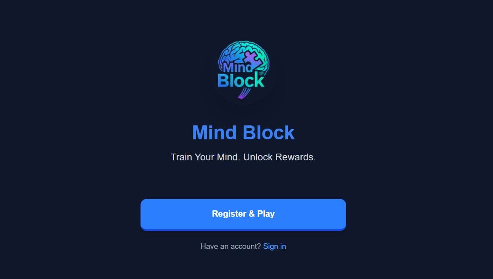

# 🧩 Mind Block App



## 📘 Introduction
**Mind Block** is a puzzle and coding challenge game that offers **adaptive, rewarding gameplay** tailored to users' IQ and preferences.  
Players solve **logic-based tasks** across categories like **coding, puzzles, blockchain, and logic** to:

- 🎮 Earn in-game recognition (xp)  
- 🚀 Boost problem-solving skills  
- 🏆 Compete socially with friends  

Mind Block is a **next-gen puzzle adventure** blending **AI-generated challenges** with **skill-based progression** in an immersive experience.  

✨ Features include:  
- Quick **IQ-level survey** to personalize your journey  
- Puzzles that evolve with your intelligence level  
- Categories: coding, logic, blockchain, and more  
- **Leaderboards** and upcoming **real-time puzzle battles**  

Whether you're a beginner or a pro, **Mind Block adapts to you**—making every challenge rewarding.

---

## 📚 Documentation

| Document | What it covers |
| -------- | -------------- |
| [docs/DEVELOPMENT.md](docs/DEVELOPMENT.md) | Full local setup, running each service, migrations, seed data, common errors |
| [docs/ENVIRONMENT.md](docs/ENVIRONMENT.md) | Every backend, frontend, and Stellar environment variable |
| [docs/API.md](docs/API.md) | REST API reference: endpoints, payloads, auth, errors |
| [docs/ARCHITECTURE.md](docs/ARCHITECTURE.md) | Monorepo layout, request lifecycle, data stores, deployment |
| [docs/TESTING.md](docs/TESTING.md) | Test, lint, type-check, and build commands, plus what CI enforces |
| [docs/CANONICAL_DOMAIN_MODEL.md](docs/CANONICAL_DOMAIN_MODEL.md) | Authoritative domain model specification |
| [CONTRIBUTING.md](CONTRIBUTING.md) | Contributor workflow, branch and PR standards |

---

## 🏗️ Project Structure
This is a **monorepo** containing three main components:

- **Backend (NestJS)** – API & game logic (`backend/`)
- **Frontend (Next.js)** – User interface (`frontend/`)
- **Smart Contract (Soroban)** – Stellar testnet deployment (`contract/`)

A full directory breakdown is in [docs/ARCHITECTURE.md](docs/ARCHITECTURE.md).

### 🌍 Hosting
- **Backend (NestJS)** → [Render](https://mindblock-webaapp.onrender.com)  
- **Frontend (NextJS)** → [Vercel](https://mind-block-app-frontend.vercel.app/)  
- **Contract (Rust)** → Stellar testnet  

---

## ✅ Prerequisites

| Tool | Version | Required for |
| ---- | ------- | ------------ |
| Node.js | **20.x LTS (>= 20.9.0)** | Backend and frontend. CI pins Node 20.x; Next.js 16 needs >= 20.9. |
| npm | **10.x** (ships with Node 20) | The repo uses npm workspaces and a committed `package-lock.json`. Do not use yarn, pnpm, or bun. |
| PostgreSQL | **14+** | Backend datastore. |
| Redis | **6+** | Sessions, JWT state, caching. The backend will not start without it. |
| Rust + `wasm32-unknown-unknown` | stable | Only if you work on `contract/`. |
| Stellar CLI | latest | Only for building or deploying the contract. |

---

## ⚡ Getting Started

The path from clone to a running stack, in order.

### 1. Clone

```bash
git clone https://github.com/MindBlockLabs/mindBlock_app.git
cd mindBlock_app
```

### 2. Install

```bash
npm ci
```

This installs every workspace from the lockfile in one pass. You can also
install a single package (`cd backend && npm install`) if you only work there.

### 3. Configure

```bash
cp backend/.env.example backend/.env
printf 'NEXT_PUBLIC_API_URL=http://localhost:3000\n' > frontend/.env.local
```

Fill in at minimum `REDIS_URL`, `JWT_SECRET`, and the `DATABASE_*` block in
`backend/.env`. Every variable is documented in
[docs/ENVIRONMENT.md](docs/ENVIRONMENT.md).

### 4. Start PostgreSQL

```bash
docker run --name mindblock-postgres \
  -e POSTGRES_USER=postgres -e POSTGRES_PASSWORD=password \
  -e POSTGRES_DB=mindblock -p 5432:5432 -d postgres:16
```

Or use a local install and `createdb mindblock`. The credentials must match
`backend/.env`.

### 5. Start Redis

```bash
docker run --name mindblock-redis -p 6379:6379 -d redis:7
redis-cli ping   # -> PONG
```

### 6. Run the backend

```bash
cd backend
npm run start:dev
```

- API: <http://localhost:3000>
- Swagger UI: <http://localhost:3000/api>
- Health: <http://localhost:3000/health>

### 7. Run the frontend

In a second terminal:

```bash
cd frontend
npm run dev
```

Next.js picks a free port (typically 3001 while the backend holds 3000); the
terminal prints the URL.

From the repo root you can also start either service without changing directory:

```bash
npm run dev:backend
npm run dev:frontend
```

> `npm run dev` starts both through `concurrently`, which is not currently
> declared as a dependency. Until it is, either run the two commands above in
> separate terminals or install it yourself (`npm i -D concurrently`).

### 8. Run the tests

```bash
npm --workspace backend run test
npm --workspace backend run test:e2e
```

Lint, type-check, and build commands are in
[docs/TESTING.md](docs/TESTING.md).

### 9. Contract (optional)

```bash
rustup target add wasm32-unknown-unknown
cargo install --locked stellar-cli

cd contract
cargo build --locked --target wasm32-unknown-unknown --release
cargo test --locked
```

Deployment identities and network setup are covered in
[docs/ENVIRONMENT.md](docs/ENVIRONMENT.md#3-stellar-and-soroban-shell-environment).

---

## 🛠️ Common commands

| Command | Runs from | What it does |
| ------- | --------- | ------------ |
| `npm --workspace backend run start:dev` | root | Backend in watch mode |
| `npm --workspace frontend run dev` | root | Frontend dev server |
| `npm --workspace backend run test` | root | Backend unit tests |
| `npm --workspace backend run test:cov` | root | Backend coverage |
| `npm --workspace backend run lint` | root | Backend ESLint |
| `npm --workspace frontend run lint` | root | Frontend ESLint |
| `npm --workspace backend run build` | root | Compile the backend |
| `npm --workspace frontend run build` | root | Production frontend build |

---

## 🚑 Troubleshooting

Hitting `REDIS_URL not defined`, `ECONNREFUSED 5432`, `EADDRINUSE :::3000`, or a
`401` on every request? Each of those, and more, is covered in
[docs/DEVELOPMENT.md](docs/DEVELOPMENT.md#12-common-errors).

---

## 👥 Contributors & Contact

📢 General Telegram Group: [Join here](https://t.me/+kjacdy68yfwwNTVk)

📧 Owner Emails:

aminubabafatima8@gmail.com

amalikabdulmalik04@gmail.com

## Contribution Guidelines

We ❤️ contributions! The full workflow, branch naming rules, PR standards, and
CI requirements live in [CONTRIBUTING.md](CONTRIBUTING.md). The short version:

1. Fork the repo and branch from `main`:

```bash
git checkout -b feature/your-feature-name
```

2. Make your change and run the checks in [docs/TESTING.md](docs/TESTING.md).

3. Commit with a Conventional Commits message:

```bash
git commit -m "feat: add puzzle leaderboard"
```

4. Push and open a Pull Request describing the problem, the solution, the
   acceptance criteria, and how you tested it.

💡 For issues/bugs, please open an issue.

📜 License

This project is licensed under the MIT License.
