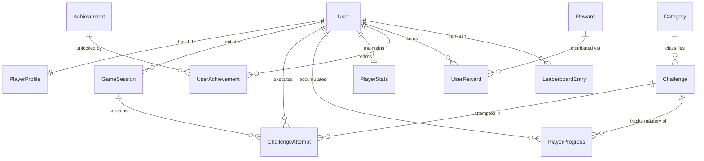

# Canonical Mind Block Domain Model

**Document Version:** 1.0.0  
**Priority:** P0 — Critical Architecture  
**Status:** Canonical Reference Specification  

---

## 1. Executive Summary & Architecture Principles

The Mind Block backend powers an interactive, personalized Web3 cognitive training and puzzle-solving platform. As the system scales with new gameplay modes, blockchain reward mechanisms, analytics, and social competition features, the core domain concepts must be clearly delineated to prevent tight coupling and technical debt.

### Core Architectural Principles
1. **Separation of Concerns:** Authentication/Identity (`User`), Player Customization (`PlayerProfile`), Gameplay Context (`GameSession`), Content Inventory (`Challenge`), and Execution Ledger (`ChallengeAttempt`) are independent domain models with distinct lifecycles.
2. **Authoritative Backend Execution:** All challenge selection, scoring, verification, and reward eligibility are calculated and verified authoritatively on the backend.
3. **Event-Driven & Decoupled Side Effects:** Progress updates, streak evaluations, achievement unlocks, and blockchain minting are triggered via domain events rather than monolithic transaction scripts.
4. **Single Source of Truth:** No duplicate entities or overlapping responsibilities.

---

## 2. Core Domain Entity Diagram

---

## 3. Detailed Entity Specifications

### 3.1. User (Identity & Authentication Root)
* **Purpose:** Serves as the core authentication, security, and account ownership boundary.
* **Responsible Service:** `UsersService`, `AuthService` (`UsersModule`, `AuthModule`)
* **Ownership:** Root aggregate entity. Deleting a user cascades or archives downstream records per privacy/GDPR compliance.
* **Fields:**
  | Field | Type | Required | Description |
  | :--- | :--- | :--- | :--- |
  | `id` | `UUID` | Yes | Unique immutable user identifier (Primary Key) |
  | `email` | `string` | No (Unique) | User email address (unique when present) |
  | `passwordHash` | `string` | No | Bcrypt password hash (null for OAuth users) |
  | `googleId` | `string` | No (Unique) | Federated Google OAuth subject identifier |
  | `stellarWallet` | `string` | No (Unique) | Public Stellar blockchain public key (`G...`) |
  | `role` | `UserRole` | Yes | `USER`, `ADMIN`, `CREATOR`, `SUPERADMIN` |
  | `status` | `UserStatus` | Yes | `ACTIVE`, `SUSPENDED`, `DELETED` |
  | `emailVerified` | `boolean` | Yes | Whether email ownership was confirmed |
  | `lastLoginAt` | `Timestamp` | No | Timestamp of most recent successful authentication |
  | `createdAt` | `Timestamp` | Yes | Account creation timestamp |
  | `updatedAt` | `Timestamp` | Yes | Account modification timestamp |

---

### 3.2. PlayerProfile (Personalization & Preferences)
* **Purpose:** Holds player settings, avatar, demographic information, learning objectives, and gameplay preferences. Decoupled from core authentication.
* **Responsible Service:** `PlayerProfileService` (`ProfileModule`)
* **Ownership:** Owned 1:1 by `User`.
* **Fields:**
  | Field | Type | Required | Description |
  | :--- | :--- | :--- | :--- |
  | `id` | `UUID` | Yes | Primary Key |
  | `userId` | `UUID` | Yes (Unique) | Foreign key to `User.id` |
  | `username` | `string` | Yes (Unique) | Public player handle (e.g. `@cryptomind`) |
  | `displayName` | `string` | Yes | Display name |
  | `avatarUrl` | `string` | No | URL to avatar image or NFT avatar |
  | `bio` | `string` | No | Player bio / motto |
  | `country` | `string` | No | ISO country code or country name |
  | `timezone` | `string` | Yes | IANA timezone (e.g. `'America/New_York'`) |
  | `defaultDifficulty`| `Difficulty` | Yes | Preferred initial difficulty (`BEGINNER`, etc.) |
  | `preferredCategories`| `UUID[]` | No | Array of Category IDs of interest |
  | `ageGroup` | `string` | No | Demographic age group (for analytics) |
  | `occupation` | `string` | No | Occupation / professional field |
  | `goals` | `string[]` | No | Target goals (e.g. `['Speed', 'Logic']`) |
  | `availableHours` | `string[]` | No | Preferred daily training hours |
  | `createdAt` | `Timestamp` | Yes | Creation timestamp |
  | `updatedAt` | `Timestamp` | Yes | Update timestamp |

---

### 3.3. GameSession (Gameplay Context & Temporal Lifecycle)
* **Purpose:** Represents an active or completed gameplay session (e.g., Daily Quest run, Practice Session, Skill Assessment, Multiplayer Match, Speedrun). Manages session-level state, rules, duration, and challenge sequence.
* **Responsible Service:** `GameSessionService` (`GameSessionModule` / `QuestsModule`)
* **Ownership:** Owned by `User`. Contains multiple `ChallengeAttempt` instances.
* **Lifecycle:** `INITIALIZED` → `IN_PROGRESS` → `COMPLETED` | `ABANDONED` | `EXPIRED`
* **Fields:**
  | Field | Type | Required | Description |
  | :--- | :--- | :--- | :--- |
  | `id` | `UUID` | Yes | Primary Key |
  | `userId` | `UUID` | Yes | Foreign key to `User.id` |
  | `gameMode` | `GameMode` | Yes | `DAILY_QUEST`, `PRACTICE`, `ASSESSMENT`, `SPEEDRUN`, `MULTIPLAYER` |
  | `status` | `SessionStatus`| Yes | `INITIALIZED`, `IN_PROGRESS`, `COMPLETED`, `ABANDONED`, `EXPIRED` |
  | `targetChallengeCount` | `int` | Yes | Number of challenges planned for this session |
  | `completedChallengeCount`| `int` | Yes | Number of challenges completed so far |
  | `totalScore` | `int` | Yes | Total score accumulated in this session |
  | `totalTimeSpent` | `int` | Yes | Seconds spent actively solving |
  | `metadata` | `JSON` | No | Session-specific context (e.g. quest date, lobby ID) |
  | `startedAt` | `Timestamp` | Yes | Session start timestamp |
  | `endedAt` | `Timestamp` | No | Session conclusion timestamp |
  | `expiresAt` | `Timestamp` | No | Expiration deadline for time-bound sessions |

---

### 3.4. Challenge (Playable Content Unit)
* **Purpose:** The canonical definition of a playable puzzle, problem, or quiz item. (Mapped from legacy `Puzzle`).
* **Responsible Service:** `ChallengesService` (`ChallengesModule` / `PuzzlesModule`)
* **Ownership:** Content entity owned by system/creators; referenced by attempts and progress.
* **Fields:**
  | Field | Type | Required | Description |
  | :--- | :--- | :--- | :--- |
  | `id` | `UUID` | Yes | Primary Key |
  | `categoryId` | `UUID` | Yes | Foreign key to `Category.id` |
  | `difficulty` | `Difficulty` | Yes | `BEGINNER`, `INTERMEDIATE`, `ADVANCED`, `EXPERT` |
  | `title` | `string` | No | Optional challenge title |
  | `question` | `string` | Yes | Question prompt / problem markdown |
  | `options` | `string[]` | Yes | Selectable answer choices |
  | `correctAnswer` | `string` | Yes | Canonical answer key (Authoritative/Private) |
  | `explanation` | `string` | No | Educational explanation after completion |
  | `hints` | `string[]` | No | Progressive hint strings |
  | `points` | `int` | Yes | Base XP / point value |
  | `timeLimit` | `int` | Yes | Time limit in seconds |
  | `isActive` | `boolean` | Yes | Whether available for active selection |
  | `tags` | `string[]` | No | Content tags (e.g. `['algorithms', 'math']`) |
  | `createdAt` | `Timestamp` | Yes | Creation timestamp |
  | `updatedAt` | `Timestamp` | Yes | Last edit timestamp |

---

### 3.5. ChallengeAttempt (Individual Interaction Instance)
* **Purpose:** Records a player's real-time interaction with a specific `Challenge`. Authoritatively tracks the submitted answer, timing, hints consumed, and outcome.
* **Responsible Service:** `ChallengeAttemptService` (`ChallengeAttemptModule`)
* **Ownership:** Owned by `User`; optionally belongs to `GameSession`; references `Challenge`.
* **Lifecycle:** `STARTED` → `SUBMITTED` → `CORRECT` | `INCORRECT` | `EXPIRED`
* **Fields:**
  | Field | Type | Required | Description |
  | :--- | :--- | :--- | :--- |
  | `id` | `UUID` | Yes | Primary Key |
  | `userId` | `UUID` | Yes | Foreign key to `User.id` |
  | `challengeId` | `UUID` | Yes | Foreign key to `Challenge.id` |
  | `sessionId` | `UUID` | No | Optional foreign key to `GameSession.id` |
  | `status` | `AttemptStatus`| Yes | `STARTED`, `SUBMITTED`, `CORRECT`, `INCORRECT`, `EXPIRED` |
  | `userAnswer` | `string` | No | Player's submitted answer (null while STARTED) |
  | `score` | `int` | Yes | Score awarded (calculated authoritatively) |
  | `timeSpent` | `int` | Yes | Time elapsed in seconds |
  | `hintsUsed` | `int` | Yes | Number of hints consumed |
  | `solutionRevealed` | `boolean` | Yes | If player forfeited to view answer |
  | `startedAt` | `Timestamp` | Yes | When attempt was initiated |
  | `submittedAt` | `Timestamp` | No | When attempt was submitted / finalized |

---

### 3.6. PlayerProgress (Mastery & Historical Completion Ledger)
* **Purpose:** Permanent historical record of player learning outcomes, category mastery, and overall challenge completion history. Used by the selection engine to avoid repeat challenges.
* **Responsible Service:** `ProgressService` (`ProgressModule`)
* **Ownership:** Owned by `User`; references `Challenge` and `Category`.
* **Fields:**
  | Field | Type | Required | Description |
  | :--- | :--- | :--- | :--- |
  | `id` | `UUID` | Yes | Primary Key |
  | `userId` | `UUID` | Yes | Foreign key to `User.id` |
  | `challengeId` | `UUID` | Yes | Foreign key to `Challenge.id` |
  | `categoryId` | `UUID` | Yes | Foreign key to `Category.id` |
  | `attemptId` | `UUID` | No | Foreign key to qualifying `ChallengeAttempt.id` |
  | `isMastered` | `boolean` | Yes | Whether solved correctly without hints |
  | `totalAttempts`| `int` | Yes | Number of attempts made by user on this challenge |
  | `bestScore` | `int` | Yes | Highest score achieved on this challenge |
  | `firstCompletedAt`| `Timestamp`| Yes | Initial successful completion |
  | `lastAttemptedAt`| `Timestamp` | Yes | Most recent attempt date |

---

### 3.7. PlayerStats (Aggregated Performance Metrics)
* **Purpose:** Fast-read materialized view / aggregate of player metrics (XP, level, current streak, longest streak, accuracy, total challenges completed). Eliminates expensive on-the-fly table scans.
* **Responsible Service:** `PlayerStatsService` / `XpLevelService` (`UsersModule` / `StreakModule`)
* **Ownership:** 1:1 with `User`.
* **Fields:**
  | Field | Type | Required | Description |
  | :--- | :--- | :--- | :--- |
  | `id` | `UUID` | Yes | Primary Key |
  | `userId` | `UUID` | Yes (Unique) | Foreign key to `User.id` |
  | `totalXp` | `int` | Yes | Total accumulated XP |
  | `currentLevel` | `int` | Yes | Current computed player level |
  | `challengesSolved`| `int` | Yes | Total distinct challenges solved |
  | `accuracyRate` | `float` | Yes | Overall accuracy percentage (0.0 - 100.0) |
  | `currentStreak` | `int` | Yes | Current active daily streak |
  | `longestStreak` | `int` | Yes | All-time highest streak achieved |
  | `lastActiveDate`| `Date` | No | Last active date (YYYY-MM-DD) for streak check |
  | `averageSolveTime`| `int` | Yes | Average seconds per solve |
  | `tokensBalance`| `int` | Yes | In-game token balance |
  | `updatedAt` | `Timestamp` | Yes | Last recalculation timestamp |

---

### 3.8. Achievement & UserAchievement (Milestones & Badges)
* **Purpose:** Defines achievements/badges and tracks individual player unlocks and claim status.
* **Responsible Service:** `AchievementsService` (`AchievementsModule`)
* **Ownership:** `Achievement` is a master catalog entity; `UserAchievement` is a join entity owned by `User`.
* **Fields (`Achievement`):**
  | Field | Type | Required | Description |
  | :--- | :--- | :--- | :--- |
  | `id` | `UUID` | Yes | Primary Key |
  | `slug` | `string` | Yes (Unique) | Identifier (e.g. `'streak-7-days'`, `'math-master'`) |
  | `title` | `string` | Yes | Achievement title |
  | `description` | `string` | Yes | Criteria description |
  | `badgeIconUrl` | `string` | Yes | Badge visual asset |
  | `category` | `string` | Yes | `STREAK`, `MASTERY`, `SPEED`, `SPECIAL` |
  | `xpReward` | `int` | Yes | Bonus XP on unlock |
  | `tokenReward` | `int` | Yes | Bonus tokens on unlock |
  | `isActive` | `boolean` | Yes | Availability toggle |

* **Fields (`UserAchievement`):**
  | Field | Type | Required | Description |
  | :--- | :--- | :--- | :--- |
  | `id` | `UUID` | Yes | Primary Key |
  | `userId` | `UUID` | Yes | Foreign key to `User.id` |
  | `achievementId`| `UUID` | Yes | Foreign key to `Achievement.id` |
  | `unlockedAt` | `Timestamp` | Yes | When criteria were fulfilled |
  | `isClaimed` | `boolean` | Yes | Whether rewards have been claimed |

---

### 3.9. Reward & UserReward (Economy & Web3 In-Game Value)
* **Purpose:** Manages the economic reward catalog (off-chain tokens, NFT badges, Stellar Soroban contract disbursements) and individual reward claims.
* **Responsible Service:** `RewardsService`, `BlockchainService` (`RewardsModule`, `BlockchainModule`)
* **Ownership:** `UserReward` is owned by `User`.
* **Fields (`Reward`):**
  | Field | Type | Required | Description |
  | :--- | :--- | :--- | :--- |
  | `id` | `UUID` | Yes | Primary Key |
  | `type` | `RewardType`| Yes | `TOKEN`, `STELLAR_NFT`, `BADGE`, `STREAK_FREEZE` |
  | `amount` | `numeric` | Yes | Amount or token value |
  | `assetCode` | `string` | No | Stellar asset code or NFT metadata URI |
  | `name` | `string` | Yes | Reward name |
  | `description` | `string` | No | Description of reward |

* **Fields (`UserReward`):**
  | Field | Type | Required | Description |
  | :--- | :--- | :--- | :--- |
  | `id` | `UUID` | Yes | Primary Key |
  | `userId` | `UUID` | Yes | Foreign key to `User.id` |
  | `rewardId` | `UUID` | Yes | Foreign key to `Reward.id` |
  | `status` | `RewardStatus` | Yes | `PENDING`, `CLAIMED`, `MINTED`, `FAILED` |
  | `txHash` | `string` | No | Stellar transaction hash if on-chain |
  | `claimedAt` | `Timestamp` | No | Claim timestamp |

---

### 3.10. LeaderboardEntry (Competitive Rankings)
* **Purpose:** High-performance ranking entity holding competitive scores across daily, weekly, and all-time intervals and specific categories.
* **Responsible Service:** `LeaderboardService` (`LeaderboardModule`)
* **Ownership:** Maintained by system; points to `User`.
* **Fields:**
  | Field | Type | Required | Description |
  | :--- | :--- | :--- | :--- |
  | `id` | `UUID` | Yes | Primary Key |
  | `userId` | `UUID` | Yes | Foreign key to `User.id` |
  | `timeframe` | `Timeframe` | Yes | `DAILY`, `WEEKLY`, `ALL_TIME`, `SEASONAL` |
  | `periodKey` | `string` | Yes | Period identifier (e.g. `'2026-W34'`, `'2026-08-19'`) |
  | `categoryId` | `UUID` | No | Null for global leaderboard; UUID for category-specific |
  | `score` | `int` | Yes | Ranking score / XP in this period |
  | `rank` | `int` | Yes | Computed ordinal rank |
  | `challengesCompleted` | `int` | Yes | Count of challenges completed in period |
  | `updatedAt` | `Timestamp` | Yes | Timestamp of score snapshot |

---

## 4. Mapping Existing Codebase Entities to the Canonical Model

| Existing Code Entity | Canonical Domain Entity | Discrepancies & Harmonization Plan |
| :--- | :--- | :--- |
| `users/user.entity.ts` (`User`) | `User` + `PlayerProfile` + `PlayerStats` | Currently, `User` contains authentication, profile (`bio`, `interests`, `country`), and stats (`xp`, `level`, `tokens`). As a progressive refactor, `User` remains backward-compatible while new features interact via `PlayerProfile` and `PlayerStats` abstractions. |
| `puzzles/entities/puzzle.entity.ts` (`Puzzle`) | `Challenge` | `Puzzle` is the concrete table representation of `Challenge`. Canonical contracts alias `Puzzle` as `Challenge`. |
| `challenge-attempt/entities/challenge-attempt.entity.ts` | `ChallengeAttempt` | Fully aligns with the canonical model. Supports `sessionId`, timing, hints, and lifecycle states. |
| `progress/entities/progress.entity.ts` (`UserProgress`) | `PlayerProgress` | Standard progress record tracking user-challenge outcomes and daily quests. |
| `progress/entities/user-progress.entity.ts` (Duplicate) | **Deprecated / Redundant** | Found duplicate `UserProgress` definition. Standardized to `progress.entity.ts` (`UserProgress`). |
| `quests/entities/daily-quest.entity.ts` (`DailyQuest`) | `GameSession` (Specialized) | `DailyQuest` functions as a specialized `GameSession` with `gameMode: DAILY_QUEST`. Future sessions leverage generalized `GameSession`. |
| `streak/entities/streak.entity.ts` (`Streak`) | `PlayerStats` (Streak Component) | Holds `currentStreak`, `longestStreak`, and `lastActiveDate`. Forms part of `PlayerStats`. |
| `categories/entities/category.entity.ts` (`Category`) | `Category` | Standard taxonomy entity classifying challenges. |

---

## 5. Database & Architecture Implications

1. **Relational Integrity & Foreign Keys:**
   - Soft-delete or cascaded deletions ensure audit logs and blockchain transaction histories (`UserReward`) remain immutable even if a user account is removed.
2. **Indexing Strategy:**
   - Composite Index `(userId, challengeId)` on `challenge_attempts` and `user_progress` for instant history checks during challenge selection.
   - Index on `(categoryId, difficulty, isActive)` on `puzzles` for sub-millisecond candidate filtering.
   - Index on `(timeframe, periodKey, score DESC)` on `leaderboard_entries` for fast pagination.
3. **Partitioning High-Volume Tables:**
   - `challenge_attempts` and `analytics_events` should be range-partitioned by `started_at` / `created_at` (monthly partitions) as query volume grows.
4. **Caching & Redis Layer:**
   - Active user session state and current challenge candidate pools are cached in Redis (`REDIS_CLIENT`) with 1-hour TTLs to prevent heavy PostgreSQL queries during active gameplay.
