# Analytics Data Flow

This document traces the full path from an in-app action to a number on the
analytics dashboard, referencing the actual files that make up each stage of
the pipeline. Use it to figure out where a change belongs before touching the
module.

## Overview

```mermaid
flowchart LR
    subgraph Game["Feature module"]
        A["XpLevelService.addXp()
backend/src/users/providers/xp-level.service.ts"]
    end

    subgraph Analytics["backend/src/analytics/"]
        B["UsersAnalyticsListener
listeners/users-analytics.listener.ts
@OnEvent('xp_awarded' | 'user_leveled_up')"]
        C[("analytics_events table
entities/analytics-event.entity.ts")]
        D["DailyActiveUsersRollupJob
jobs/daily-active-users-rollup.job.ts
@Cron(EVERY_DAY_AT_MIDNIGHT)"]
        E[("daily_active_users table
entities/daily-active-user.entity.ts")]
        F["GetDauProvider
providers/get-dau.provider.ts
(not yet implemented)"]
        G["AnalyticsController
controllers/analytics.controller.ts"]
    end

    subgraph Frontend["frontend/"]
        H["getDauMauMetrics()
lib/api/analyticsApi.ts"]
        I["DauMauChart
components/analytics/DauMauChart.tsx"]
        J["Analytics page
app/analytics/page.tsx"]
    end

    A -- "eventEmitter.emit('xp_awarded', ...)" --> B
    B -- "analyticsEventRepository.save()" --> C
    C -- "raw rows for the previous day" --> D
    D -- "dedup userIds, delete+save" --> E
    E -- "read (cheap COUNT, no scan)" --> F
    F -. "route not wired yet" .-> G
    G -- "GET /analytics/dau-mau" --> H
    H --> I
    I --> J
```

## Pipeline stages

| # | Stage | File | Responsibility |
|---|-------|------|-----------------|
| 1 | Event emission | [`backend/src/users/providers/xp-level.service.ts`](../users/providers/xp-level.service.ts) | Business logic (`addXp()`) fires domain events (`xp_awarded`, `user_leveled_up`) via `EventEmitter2`, fire-and-forget so the request path isn't blocked. |
| 2 | Event capture | [`listeners/users-analytics.listener.ts`](listeners/users-analytics.listener.ts) | `@OnEvent` handlers translate domain events into `AnalyticsEvent` rows and persist them. |
| 3 | Raw storage | [`entities/analytics-event.entity.ts`](entities/analytics-event.entity.ts) | `analytics_events` table — one row per raw event (`eventType`, `userId`, `entityId`, `payload`, `timestamp`). |
| 4 | Nightly rollup | [`jobs/daily-active-users-rollup.job.ts`](jobs/daily-active-users-rollup.job.ts) | `@Cron(EVERY_DAY_AT_MIDNIGHT)` job dedupes `userId`s from the previous day's raw events and materializes one row per active user. |
| 5 | Aggregated storage | [`entities/daily-active-user.entity.ts`](entities/daily-active-user.entity.ts) | `daily_active_users` table — pre-aggregated, so reads don't need to scan raw events. |
| 6 | Read provider | `providers/get-dau.provider.ts` (**not yet implemented**) | Would read `daily_active_users` with a cheap `COUNT`/`find` instead of `SELECT DISTINCT` over raw events. |
| 7 | API | [`controllers/analytics.controller.ts`](controllers/analytics.controller.ts) | Exposes providers over HTTP (e.g. `POST /analytics/track`, `GET /analytics/funnel/onboarding`, `GET /analytics/users/retention`). A `GET /analytics/dau-mau` route is expected by the frontend but not yet added here. |
| 8 | Frontend fetch | [`frontend/lib/api/analyticsApi.ts`](../../../frontend/lib/api/analyticsApi.ts) | `getDauMauMetrics()` already calls `GET /analytics/dau-mau`, ahead of the backend route existing. |
| 9 | Dashboard | [`frontend/components/analytics/DauMauChart.tsx`](../../../frontend/components/analytics/DauMauChart.tsx) rendered from [`frontend/app/analytics/page.tsx`](../../../frontend/app/analytics/page.tsx) | Turns the API response into the chart the player/ops team sees. |

## Other patterns in this module

Not every metric follows the "raw events → nightly rollup → provider" shape
above — the module currently has other read patterns worth knowing about:

- **Query raw events directly** — [`providers/get-onboarding-funnel.provider.ts`](providers/get-onboarding-funnel.provider.ts)
  counts `AnalyticsEvent` rows per funnel stage on every request. No rollup;
  fine for low-cardinality funnel counts, wired up at `GET /analytics/funnel/onboarding`.
- **Pre-aggregated, rollup job still missing** — [`providers/get-retention-curve.provider.ts`](providers/get-retention-curve.provider.ts)
  reads [`entities/retention-cohort.entity.ts`](entities/retention-cohort.entity.ts)
  (`retention_cohorts`), which its own docstring says is "populated by a
  nightly aggregation job" — that job doesn't exist in the codebase yet, even
  though the provider itself is wired up (admin-only) at `GET /analytics/users/retention`.

See [`DATA_DICTIONARY.md`](DATA_DICTIONARY.md) for full entity/column
definitions and [`EVENT_TAXONOMY.md`](EVENT_TAXONOMY.md) for event-naming
rules.

## Adding a new metric

1. Emit a domain event from the owning feature module (naming per
   [`EVENT_TAXONOMY.md`](EVENT_TAXONOMY.md)), or reuse an existing one.
2. Add an `@OnEvent` handler in a listener under `listeners/` to persist it as
   an `AnalyticsEvent`.
3. If the metric needs aggregation, add a `@Cron` job under `jobs/` that reads
   raw events and writes a dedicated summary entity — see
   `jobs/daily-active-users-rollup.job.ts` for the pattern.
4. Add a `Get*Provider` under `providers/` that reads the summary entity (or
   raw events, for cheap/low-volume queries).
5. Expose it via a route on `controllers/analytics.controller.ts`.
6. Wire the frontend call in `frontend/lib/api/analyticsApi.ts` and consume it
   from a dashboard component.
